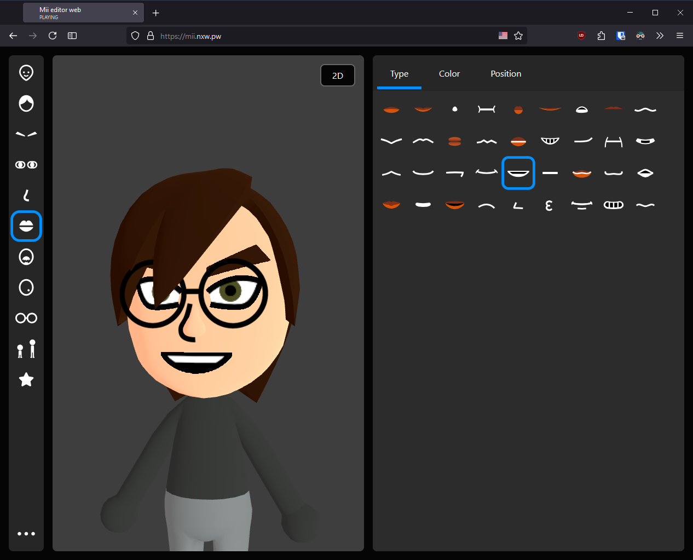

# Mii Creator App

Create and share Mii characters online with just a few clicks!

## Credits

- A version of the [mii-unsecure.ariankordi.net](https://mii-unsecure.ariankordi.net) API by [ariankordi](https://github.com/ariankordi), used to generate 3D Mii heads and renders.
- `mii-js` library used for interacting with Mii data in a JavaScript-friendly way
- [Some code](https://github.com/datkat21/mii-maker-real/tree/master/src/external/mii-frontend) "borrowed" from arian's website.
- Custom Mii Maker music by [objecty](https://x.com/objecty)

## Features

This app uses a custom version of the FFSD data type that I call the MiiCreator format (.miic), allowing for custom colors and types from the Switch, while still allowing you to convert back to 3DS/Wii U.

- [x] Real 3D rendering unlike Mii Studio
- [x] Change parts and colors of the Mii
- [x] Save and load Miis in your library
- [x] Save a Mii QR code
- [x] Render to PNG file
- [x] Save/load .FFSD/.miic
- [x] Create your own renders
- [x] Custom hats (for fun)

## Contributing

I'm open to contributions if you want to help on the project!

## Credits

Many of the custom hat models are provided by the Models Resource:

- [Top Hat](https://www.models-resource.com/nintendo_switch/supersmashbrosultimate/model/30314/)
- [Ribbon & Bow](https://www.models-resource.com/3ds/nintendogscats/model/30239/)
- [Cat Ears](https://www.models-resource.com/pc_computer/narutotoborutoshinobistriker/model/46502/)

## Setting up development

1. Make sure you have [Bun](https://bun.sh/) installed on your device. This is used for compiling all of the TypeScript code into JavaScript for the client.
2. Clone this repository, and run the `bun i` command to install dependencies.
3. In one terminal, run `bun build-ts`, and in another, run `bun serve`. If `bun serve` doesn't work, try `bunx serve`. (There is also an optional Go server if you want to use that over the bun server. Both seem to have a strange issue on Windows where you have to wait 5 seconds before you are allowed to refresh the page..)
4. Any changes you make should log in the build-ts terminal, and check the server on the second terminal to find the port. Live server is not advised when using my build script because it sometimes can refresh too much.
